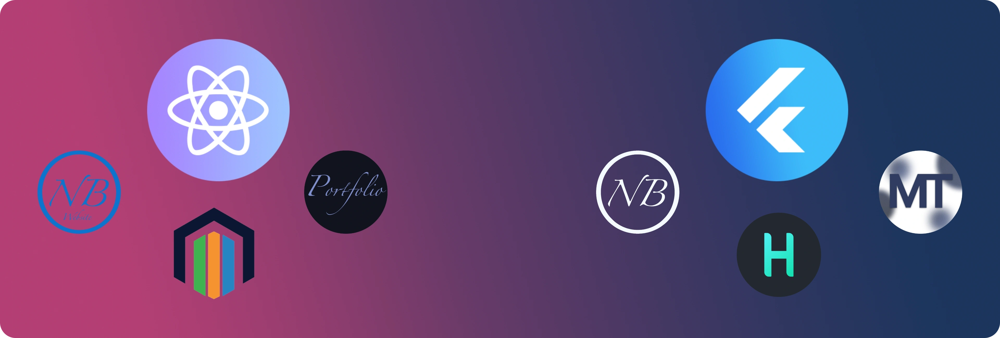

# Et bonjour ^^ 👋

## Un peu sur moi

Passionné d’informatique depuis tout petit, je suis un touche-à-tout curieux. J’ai commencé en démontant des ordinateurs pour apprendre à les réparer (j'avais déjà le reverse engineering dans la peau 😉), puis, une fois arrivé au lycée, je me suis lancé dans le scripting avec Python. Je concède qu’à cette époque, mes motivations n’étaient guère nobles (embêter les camarades), mais elles m’ont permis d’acquérir des bases essentielles qui m'ont ensuite conduit à découvrir le monde du développement mobile, dont je suis tombé amoureux quelques années plus tard. Aujourd'hui j'utilise Flutter et React afin de réaliser mes projets allant du serveur domestique à l'application de gestion en passant par le site internet vitrine. J'accorde bien sur un peu de temps au C étant maintenant un fière étudiant de 42 ^^.
## Mes impératifs
- L’organisation : J’aime que les choses soient bien cadrées dès le départ. Pas de navigation à vue !
- La clarté : Je privilégie les solutions simples à celles pleines de paillettes, pour un résultat plus efficace.
- Le pragmatisme : J’aime explorer de nouvelles technologies et méthodes, mais je garde toujours en tête leur impact pratique. Mon objectif est d’innover là où cela fait vraiment la différence, sans ajouter de complexité inutile.
- La transparence : Autant personnellement que professionnellement, je mets un point d’honneur à entretenir des relations transparentes. Les non-dits sont un fléau, et je les fuis.
